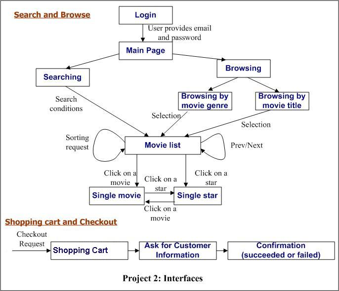
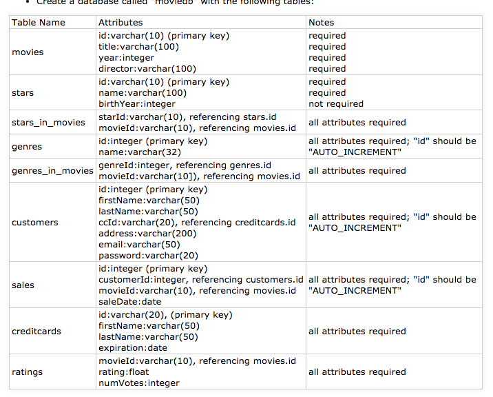

# Fabflix
A movie selling website with full functionalities including login, searching, sorting, browse, autocomplete, fuzzy search, checkout, and employee dashboard.
It is hosted on AWS EC2 and Google Cloud Platform apache2 server(with load balancing).

## Website Demo:
URL: http://www.ucimemory.com/Fabflix-website

## Project Architecture


## Movie Database Schema

## Stress Test Report:
* Tool: JMeter
* Location: Landing page of the Github Repository

* Usage of the parser:
The parser we wrote is parser.py, In order to run it, go to the directory ```/Fabflix-website/target/``` and run the following command:

    ```python3 parser.py```
    
    in terminal to see the expected output for all 9 test cases(stored in 9 log files: log11-log15.txt and log21-log24.txt)
